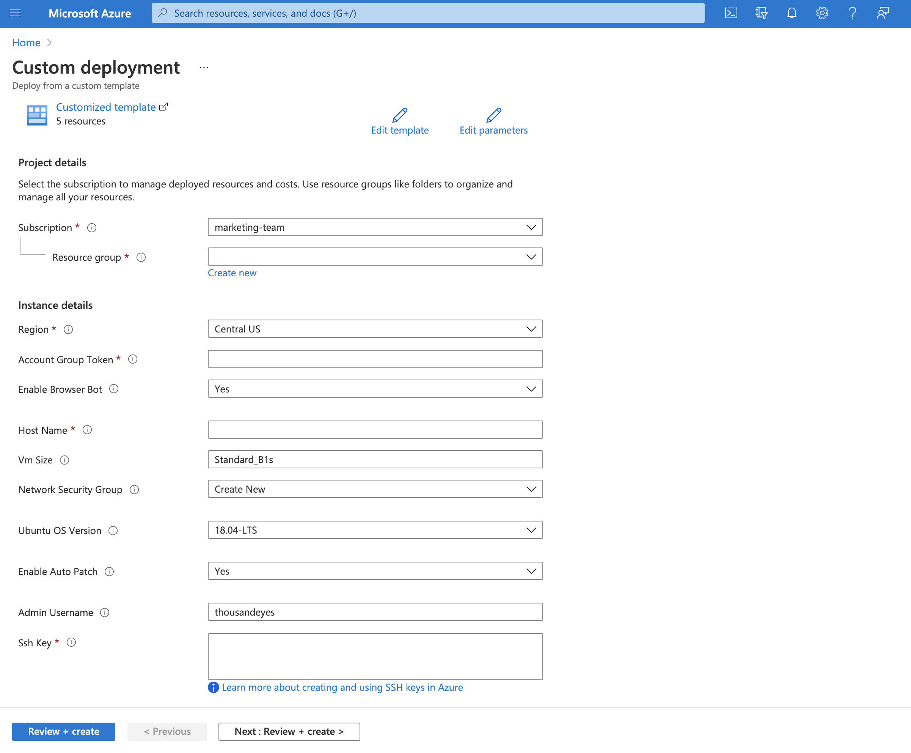

# Azure One-Click Deployment for ThousandEyes Enterprise Agent
 

This Azure ARM Template deploys an Ubuntu based ThousandEyes Enterprise Agent in your Azure cloud environment. This requires an active ThousandEyes account; if you don't have one, you can start a fully featured [free trial](https://www.thousandeyes.com/signup/).

# Deployment Steps

1. Click on the "Deploy to Azure" button above. This will launch the Azure deployment wizard.
2. Enter the required deployment details, like ThousandEyes Account Token. Descriptions of options are provided in the deployment wizard.
3. Click `Review + create`; Azure will validate and deploy your ThousandEyes Agent in your Azure cloud environment. You should see your ThousandEyes Enterprise Agent come online a few minutes after initial deployment.

# Notes
## Automatic OS Patching and Updates
This ThousandEyes Azure deployment template includes two features that ensure every ThousandEyes Enterprise Agent is running on the most up-to-date and secure version of Ubuntu (or other suported linux distros):

* **Quarterly OS Updates** - the ThousandEyes Enterprise Agent template currently uses standard Ubuntu OS images 18.04 or 20.04 LTS. These are maintained and patched by Microsoft on a quarterly basis. See Azure docs on [endorsed distros](https://docs.microsoft.com/en-us/azure/virtual-machines/linux/endorsed-distros) for more details. 
  
* **Automatic Security Patching** - the template provides the option to enable Azure Auto Patching. This is a public preview feature (as of July 2021) that automatically updates the agent OS image to the latest patch of Ubuntu. Critical and Security patches are downloaded and applied automatically on the VM. Agent will automatically reboot if necessary. See Azure documentation on [guest patching](https://docs.microsoft.com/en-us/azure/virtual-machines/automatic-vm-guest-patching) for more details.

## Supported OS Images
* Currently only Ubuntu 18.04 and 20.04 LTS are supported. Future Ubuntu LTS versions will be added as options when they become supported. 
* Red Hat Enterprise Linux (RHEL) may be added in the future, but requires an additional paid subscription.

## Other Notes
* This template currently only supports creating a new Network Security Group, which defaults to limiting inbound traffic to Port 22 (SSH). 
* This template currently only creates a single Network Interface.